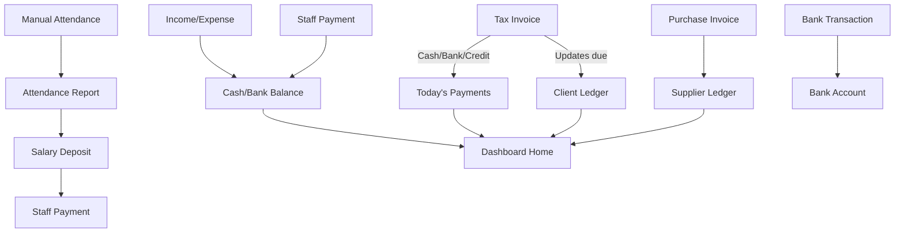

# Shahin → Punchless Implementation Plan

> **Created:** 2026-06-22  
> **Goal:** Bring Shahin Motors BMS features into Punchless web dashboard — without losing GPS attendance advantage  
> **Reference audit:** [`grok-md.md`](./grok-md.md)  
> **Legend:** ✅ Done · 🟡 Partial · ☐ Not started · 🔒 Punchless-only (keep)

---

## Table of Contents

1. [Deep Analysis — What Shahin Really Is](#1-deep-analysis--what-shahin-really-is)
2. [Punchless Current State (Verified)](#2-punchless-current-state-verified)
3. [Master Feature Checklist](#3-master-feature-checklist)
4. [Accessibility & UX Plan](#4-accessibility--ux-plan)
5. [Architecture — How to Merge Both Systems](#5-architecture--how-to-merge-both-systems)
6. [Phased Build Plan (Phase 11–18)](#6-phased-build-plan-phase-1118)
7. [Database Schema Roadmap](#7-database-schema-roadmap)
8. [File & Route Map (Per Module)](#8-file--route-map-per-module)
9. [Sidebar Redesign (Accessible Navigation)](#9-sidebar-redesign-accessible-navigation)
10. [Risk & Decision Log](#10-risk--decision-log)
11. [Recommended Start Order](#11-recommended-start-order)

---

## 1. Deep Analysis — What Shahin Really Is

Shahin is **not just an attendance app**. It is a **complete workshop ERP** built for Indian motors businesses (Gujarat-style accounting). It has **5 logical layers**:

```
┌─────────────────────────────────────────────────────────────┐
│  LAYER 5 — ADMIN          Users, audit log, password        │
├─────────────────────────────────────────────────────────────┤
│  LAYER 4 — REPORTS        8 report types + Excel + Print   │
├─────────────────────────────────────────────────────────────┤
│  LAYER 3 — FINANCE        Banks, income/expense, Rojmel     │
├─────────────────────────────────────────────────────────────┤
│  LAYER 2 — COMMERCE       Clients, suppliers, invoices, GST │
├─────────────────────────────────────────────────────────────┤
│  LAYER 1 — HR             Staff, posts, attendance, salary    │
└─────────────────────────────────────────────────────────────┘
```

### 1.1 Shahin Data Flow (how modules connect)



**Key insight:** Shahin's dashboard home is a **financial aggregation layer**. Every transaction (invoice, payment, expense, bank entry) feeds into home stats. Punchless dashboard only aggregates **attendance + jobs + advances** — that's why it feels empty compared to Shahin.

### 1.2 Shahin vs Punchless — Mental Model

| Shahin thinks in… | Punchless thinks in… |
|-------------------|----------------------|
| Money (₹ in/out) | Time (hours worked) |
| Clients owe us | Employees are working |
| Cash + Bank + Credit | Workshop + Travel + On-site |
| Monthly salary lump sum | Hourly rate × tracked hours |
| Manual data entry | GPS auto-tracking |

**Merge strategy:** Keep Punchless time engine. **Add** Shahin money layer on top. Salary should show **both**:
- Auto-calculated from GPS hours (Punchless way)
- Manual payments/deposits (Shahin way) for cash actually paid out

### 1.3 What makes Shahin "accessible" to workshop owners

| Shahin Pattern | Why owners like it | Punchless gap |
|----------------|---------------------|---------------|
| Phone number login | No email needed | Email-only auth |
| One-page modules | Everything on one screen | Multi-step flows |
| Quick Access grid on home | 14 shortcuts, no hunting | No quick links |
| Cash/Bank/Credit everywhere | Matches how they think | Not built |
| Print button on every page | Paper backup culture | No print |
| Gujarati terms (Rojmel) | Familiar accounting | English-only |
| Big numbers on dashboard | See business health instantly | 4 small stat cards |
| Sticky notes | Daily reminders on home | Not built |
| Data lock with password | Privacy on shared PC | Not built |

---

## 2. Punchless Current State (Verified)

### 2.1 Original Phases (1–10)

| Phase | Name | Status | Notes |
|-------|------|--------|-------|
| 1 | Project Setup | ✅ Done | Monorepo, packages, theming |
| 2 | Auth & Company | ✅ Done | Supabase email auth, multi-tenant |
| 3 | Workshops & Employees | ✅ Done | CRUD + map picker |
| 4 | Attendance Engine (Web) | ✅ Done | Live + manual sessions |
| 5 | Job & Travel Tracking | ✅ Done | Full CRUD + status workflow |
| 6 | Salary Calculation | ✅ Done | Monthly report from attendance hours |
| 7 | Salary Advances | ✅ Done | Approve/reject + salary deduction |
| 8 | Mobile App | 🟡 In Progress | GPS, jobs, salary, advances connected |
| 8.5 | Break + Corrections + History | ✅ Done | Web + mobile |
| 9 | Settings & Polish | 🟡 Partial | Settings page exists; dashboard home still placeholder |
| 10 | Stripe Billing | ☐ Pending | Placeholder page only |

### 2.2 Web Dashboard Routes (live today)

| Route | File | Status |
|-------|------|--------|
| `/dashboard` | `dashboard/page.tsx` | 🟡 4 stat cards + placeholder sections |
| `/dashboard/employees` | `employees/employee-manager.tsx` | ✅ Full CRUD |
| `/dashboard/workshops` | `workshops/workshop-manager.tsx` | ✅ Full CRUD + map |
| `/dashboard/jobs` | `jobs/job-manager.tsx` | ✅ Full CRUD + map |
| `/dashboard/attendance` | `attendance/attendance-manager.tsx` | ✅ Live + manual |
| `/dashboard/history` | `history/history-manager.tsx` | ✅ Summary + sessions |
| `/dashboard/requests` | `requests/requests-manager.tsx` | ✅ Correction workflow |
| `/dashboard/salary` | `salary/salary-manager.tsx` | ✅ Monthly auto report |
| `/dashboard/advances` | `advances/advance-manager.tsx` | ✅ Full workflow |
| `/dashboard/settings` | `settings/settings-manager.tsx` | 🟡 Work schedule only |
| `/dashboard/billing` | `billing/page.tsx` | ☐ Placeholder |

### 2.3 Database Tables (exist today)

| Table | Status | Shahin equivalent |
|-------|--------|-------------------|
| `companies` | ✅ | Business entity (+ settings columns) |
| `users` | ✅ | Staff (partial — missing post, bank, joining date) |
| `workshops` | ✅ 🔒 | No Shahin equivalent |
| `jobs` | ✅ 🔒 | Partial (vehicle on invoice only in Shahin) |
| `attendance_sessions` | ✅ 🔒 | Manual attendance + report |
| `salary_advances` | ✅ | Staff Payments → Advance type |
| `correction_requests` | ✅ 🔒 | No Shahin equivalent |

**0 finance/CRM tables exist today.**

---

## 3. Master Feature Checklist

> Tick = implemented in Punchless web dashboard. Based on code audit 2026-06-22.

### 3.1 Authentication & Shell

| # | Shahin Feature | Punchless | Status |
|---|----------------|-----------|--------|
| 1 | Contact number login | Email login | 🟡 Different method |
| 2 | Password login | ✅ | ✅ |
| 3 | Company branding on login | Basic login page | 🟡 |
| 4 | Support phone on login | Not shown | ☐ |
| 5 | Sidebar navigation | ✅ `sidebar.tsx` | ✅ |
| 6 | Role-based menu | ✅ owner/admin filter | ✅ |
| 7 | User greeting in header | Name + role badge | ✅ |
| 8 | Logout | ✅ | ✅ |
| 9 | Change password page | Not built | ☐ |
| 10 | Dashboard users (admin accounts) | Supabase auth only | ☐ |

### 3.2 Dashboard Home

| # | Shahin Feature | Punchless | Status |
|---|----------------|-----------|--------|
| 11 | Financial overview cards (Income/Expense/Cash/Bank/Credit) | 4 attendance stat cards | ☐ |
| 12 | Client due summary | — | ☐ |
| 13 | Supplier payable summary | — | ☐ |
| 14 | Revenue chart (7 days / 6 months) | — | ☐ |
| 15 | Quick Access shortcut grid | — | ☐ |
| 16 | Today's payments table | — | ☐ |
| 17 | Top pending dues list | — | ☐ |
| 18 | Sticky notes widget | — | ☐ |
| 19 | Data lock (hide financials) | — | ☐ |
| 20 | Live clock + FY display | — | ☐ |
| 21 | Recent attendance section | Placeholder text | 🟡 |
| 22 | Recent jobs section | Placeholder text | 🟡 |

### 3.3 CRM — Clients

| # | Shahin Feature | Punchless | Status |
|---|----------------|-----------|--------|
| 23 | Client CRUD (name, alias, contact, address, GST) | — | ☐ |
| 24 | Opening balance | — | ☐ |
| 25 | Running due amount | — | ☐ |
| 26 | Receive payment modal (Cash/Bank) | — | ☐ |
| 27 | Client statement (date range) | — | ☐ |
| 28 | Soft delete + recover | — | ☐ |
| 29 | Summary cards (count + total due) | — | ☐ |

### 3.4 CRM — Suppliers

| # | Shahin Feature | Punchless | Status |
|---|----------------|-----------|--------|
| 30 | Supplier CRUD | — | ☐ |
| 31 | Opening balance + payable | — | ☐ |
| 32 | Pay Now modal (Cash/Bank) | — | ☐ |
| 33 | Purchase invoices | — | ☐ |
| 34 | GST slabs on purchase (5/12/18/28%) | — | ☐ |

### 3.5 Invoicing

| # | Shahin Feature | Punchless | Status |
|---|----------------|-----------|--------|
| 35 | Tax invoice CRUD | — | ☐ |
| 36 | Vehicle number field | Job has customer info only | 🟡 |
| 37 | GST breakdown on invoice | — | ☐ |
| 38 | Payment mode (Cash/Credit/Bank/Split) | — | ☐ |
| 39 | Invoice number auto/manual | — | ☐ |
| 40 | Invoice report with period filter | — | ☐ |
| 41 | Print invoice | — | ☐ |

### 3.6 HR — Staff (Shahin `manageStaff.php`)

| # | Shahin Feature | Punchless | Status |
|---|----------------|-----------|--------|
| 42 | Staff name | `full_name` | ✅ |
| 43 | Contact / phone | `phone` | ✅ |
| 44 | Address | — | ☐ |
| 45 | Post / job title | `role` only (owner/admin/employee) | 🟡 |
| 46 | Monthly salary | `monthly_salary` | ✅ |
| 47 | Joining date | — | ☐ |
| 48 | Total duration (auto Y/M/D) | — | ☐ |
| 49 | Bank account number | — | ☐ |
| 50 | IFSC code | — | ☐ |
| 51 | Workshop assignment | `workshop_id` | ✅ 🔒 |
| 52 | Hourly rate (auto from salary) | `hourly_rate` | ✅ 🔒 |
| 53 | Active/inactive toggle | `is_active` | ✅ |
| 54 | Link to staff statement | — | ☐ |
| 55 | Quick payment link (₹) | Advances page separate | 🟡 |

### 3.7 HR — Posts

| # | Shahin Feature | Punchless | Status |
|---|----------------|-----------|--------|
| 56 | Post/position CRUD (OWNER, MECHANIC…) | — | ☐ |
| 57 | Assign post to staff | — | ☐ |

### 3.8 Attendance

| # | Shahin Feature | Punchless | Status |
|---|----------------|-----------|--------|
| 58 | Manual bulk attendance (present/absent) | Manual session create | 🟡 |
| 59 | GPS auto attendance | Mobile app | ✅ 🔒 |
| 60 | State machine (workshop/travel/on-site/break) | ✅ | ✅ 🔒 |
| 61 | Live attendance dashboard | ✅ | ✅ |
| 62 | Attendance history | ✅ `/history` | ✅ |
| 63 | Monthly attendance report | History with period filter | 🟡 |
| 64 | Excel export | — | ☐ |
| 65 | Delete attendance records | Delete session in attendance page | 🟡 |
| 66 | Correction requests | ✅ `/requests` | ✅ 🔒 |
| 67 | Print attendance sheet | — | ☐ |

### 3.9 Salary & Payments

| # | Shahin Feature | Punchless | Status |
|---|----------------|-----------|--------|
| 68 | Auto salary from tracked hours | ✅ `/salary` | ✅ 🔒 |
| 69 | Staff payments (Advance/Salary Paid/Deduction) | Advances only | 🟡 |
| 70 | Payment mode Cash/Bank | — | ☐ |
| 71 | Salary deposit (accrual tracking) | — | ☐ |
| 72 | Staff statement (date range ledger) | — | ☐ |
| 73 | Advance approve/reject with notes | ✅ `/advances` | ✅ |
| 74 | Advance deducted from salary report | ✅ in salary queries | ✅ |
| 75 | Company work schedule settings | ✅ `/settings` | ✅ |

### 3.10 Banking & Finance

| # | Shahin Feature | Punchless | Status |
|---|----------------|-----------|--------|
| 76 | Bank account CRUD | — | ☐ |
| 77 | Bank deposit/withdraw transactions | — | ☐ |
| 78 | Bank-to-bank transfer | — | ☐ |
| 79 | Bank statement (date range) | — | ☐ |
| 80 | Income/Expense entry | — | ☐ |
| 81 | Transaction types (Income/Expense/Transfer) | — | ☐ |
| 82 | Cash/Bank/Credit payment modes | — | ☐ |
| 83 | Rojmel ledger report | — | ☐ |

### 3.11 Reports

| # | Shahin Feature | Punchless | Status |
|---|----------------|-----------|--------|
| 84 | Daily report (summary.php) | — | ☐ |
| 85 | Monthly report | Salary report only | 🟡 |
| 86 | Yearly report | — | ☐ |
| 87 | GST report | — | ☐ |
| 88 | Invoice report | — | ☐ |
| 89 | Income/Expense report | — | ☐ |
| 90 | Expense report | — | ☐ |
| 91 | Rojmel report | — | ☐ |
| 92 | Period presets (Today/Week/Month…) | History has some filters | 🟡 |
| 93 | Print reports | — | ☐ |
| 94 | Excel export | — | ☐ |

### 3.12 Admin & Audit

| # | Shahin Feature | Punchless | Status |
|---|----------------|-----------|--------|
| 95 | User log / audit trail | — | ☐ |
| 96 | Sticky notes | — | ☐ |
| 97 | Data lock on dashboard | — | ☐ |

### 3.13 Punchless-Only (Keep — Do Not Replace)

| # | Feature | Status |
|---|---------|--------|
| 98 | Workshop GPS geofence | ✅ 🔒 |
| 99 | Job assignment + travel tracking | ✅ 🔒 |
| 100 | Break in/out system | ✅ 🔒 |
| 101 | Correction request workflow | ✅ 🔒 |
| 102 | Multi-tenant SaaS (company_id) | ✅ 🔒 |
| 103 | Mobile employee app | 🟡 🔒 |
| 104 | Map picker (Leaflet) | ✅ 🔒 |

### Summary Score

| Category | Done | Partial | Not Started |
|----------|------|---------|-------------|
| Auth & Shell | 5 | 2 | 3 |
| Dashboard Home | 0 | 2 | 9 |
| CRM (Clients/Suppliers) | 0 | 0 | 11 |
| Invoicing | 0 | 1 | 6 |
| HR Staff | 6 | 2 | 7 |
| Attendance | 4 | 3 | 2 |
| Salary | 3 | 1 | 4 |
| Banking/Finance | 0 | 0 | 8 |
| Reports | 0 | 2 | 9 |
| Admin | 0 | 0 | 3 |
| Punchless-only | 5 | 1 | 0 |
| **TOTAL** | **23 ✅** | **14 🟡** | **62 ☐** |

**Overall Shahin parity: ~23% complete · ~14% partial · ~62% not built**

---

## 4. Accessibility & UX Plan

> Goal: More accessible than Shahin — not just a copy.

### 4.1 Information Architecture (IA)

**Problem:** Shahin has 30+ flat menu items. Punchless has 11. Adding 30 more flat items will overwhelm users.

**Solution:** Grouped collapsible sidebar (Shahin dropdowns + Punchless clarity):

```
🏠 Dashboard
👥 People
   ├── Employees
   ├── Posts          ← new
   └── Workshops      ← Punchless only
📋 Operations
   ├── Attendance
   ├── History
   ├── Requests
   └── Jobs           ← Punchless only
💰 Finance
   ├── Clients
   ├── Suppliers
   ├── Invoices
   ├── Purchases
   ├── Transactions
   └── Banks
💵 Payroll
   ├── Salary Report
   ├── Payments       ← new (Shahin staff payments)
   ├── Deposits       ← new
   └── Advances
📊 Reports
   ├── Daily
   ├── Monthly
   ├── Yearly
   ├── GST
   ├── Invoices
   ├── Expenses
   └── Rojmel
⚙️ Settings
   ├── Company
   ├── Users
   ├── Audit Log
   └── Billing
```

### 4.2 Accessibility Checklist (WCAG + Workshop Owner UX)

| # | Improvement | Why | Phase |
|---|-------------|-----|-------|
| A1 | Collapsible sidebar groups with `aria-expanded` | Screen reader + less overwhelm | 11A |
| A2 | Skip-to-content link | Keyboard users | 11A |
| A3 | Focus visible rings on all interactive elements | Keyboard navigation | 11A |
| A4 | `aria-label` on icon-only buttons | Screen readers | 11A |
| A5 | Minimum 44px touch targets on mobile | Workshop owners use phones | 11A |
| A6 | Responsive sidebar → bottom tab bar on mobile | Mobile dashboard access | 11A |
| A7 | High contrast mode (already have dark/light) | Outdoor/shop lighting | ✅ exists |
| A8 | `lang` attribute + Hindi/Gujarati labels (optional) | Local language | 17 |
| A9 | Phone number login option | Shahin owners don't use email | 12 |
| A10 | Large number formatting (₹1,23,456 Indian style) | Already in `formatCurrency` | ✅ |
| A11 | Print-friendly CSS (`@media print`) on all reports | Paper culture | 15 |
| A12 | Global search (Cmd+K) across clients/staff/invoices | Faster than Shahin menus | 14 |
| A13 | Breadcrumbs on every page | Know where you are | 11A |
| A14 | Empty states with action buttons | "No clients yet → Add Client" | 11B |
| A15 | Toast confirmations (already have sonner) | Feedback on actions | ✅ |
| A16 | Loading skeletons on data tables | Perceived performance | 11B |
| A17 | Reduce motion preference (`prefers-reduced-motion`) | Accessibility | 11A |
| A18 | Form labels + error messages linked with `aria-describedby` | Form accessibility | 11B |

### 4.3 Dashboard Home — Accessible Redesign

Replace placeholder home with **3 zones** (progressive disclosure):

```
ZONE 1 — At a glance (always visible)
  [Income] [Expense] [Cash] [Bank] [Employees Working] [Pending Dues]

ZONE 2 — Quick actions (one-click, large buttons)
  [+ Invoice] [+ Client] [+ Expense] [Attendance] [Salary] [Reports]

ZONE 3 — Details (collapsible sections)
  ▼ Today's Payments
  ▼ Top Pending Dues
  ▼ Revenue Chart
  ▼ Sticky Notes
  ▼ Recent Attendance (Punchless)
  ▼ Active Jobs (Punchless)
```

**Data lock:** Optional toggle — hides Zone 1 financial numbers (like Shahin). Uses owner PIN stored in company settings, not hardcoded JS.

### 4.4 Consistent Patterns (copy Shahin's simplicity)

Every list page follows the same layout:

```
┌─────────────────────────────────────────────┐
│ Page Title                    [+ Add] [Print]│
├─────────────────────────────────────────────┤
│ Summary Cards (2-3 max)                       │
├─────────────────────────────────────────────┤
│ Add/Edit Form (collapsible or modal)          │
├─────────────────────────────────────────────┤
│ Search + Filters + Period                     │
├─────────────────────────────────────────────┤
│ Data Table (paginated 25/50/100)              │
└─────────────────────────────────────────────┘
```

Reuse one `<DataTable>` and one `<PageHeader>` component in `packages/ui/`.

---

## 5. Architecture — How to Merge Both Systems

### 5.1 Core Principle: Dual Engine

```
┌──────────────────┐     ┌──────────────────┐
│  TIME ENGINE     │     │  MONEY ENGINE    │
│  (Punchless)     │     │  (Shahin-new)    │
│                  │     │                  │
│ attendance_      │     │ clients          │
│ sessions         │     │ suppliers        │
│ jobs             │     │ invoices         │
│ workshops        │     │ transactions     │
│ correction_      │     │ bank_accounts    │
│ requests         │     │ staff_payments   │
└────────┬─────────┘     └────────┬─────────┘
         │                        │
         └──────────┬─────────────┘
                    ▼
         ┌──────────────────┐
         │  PAYROLL BRIDGE  │
         │                  │
         │ salary_report =  │
         │ hours × rate     │
         │ - advances       │
         │ - deductions     │
         │ vs paid_amount   │
         │ = balance due    │
         └──────────────────┘
```

### 5.2 Payment Mode Enum (use everywhere)

```ts
type PaymentMode = 'cash' | 'bank' | 'credit';
```

Used on: client payments, supplier payments, invoices, transactions, staff payments.

### 5.3 Shared Ledger Pattern

Every financial event writes to `ledger_entries`:

```sql
ledger_entries (
  id, company_id,
  entity_type,  -- 'client' | 'supplier' | 'staff' | 'bank' | 'expense'
  entity_id,
  entry_type,   -- 'debit' | 'credit'
  amount,
  payment_mode,
  bank_id,
  reference_type, -- 'invoice' | 'payment' | 'advance' | 'salary' | 'expense'
  reference_id,
  remark,
  created_by,
  created_at
)
```

This powers: Client Statement, Staff Statement, Bank Statement, Rojmel Report — **one table, many views**.

### 5.4 Do NOT Duplicate

| Don't build separately | Build once, reuse |
|------------------------|-------------------|
| Client statement query | `ledger_entries` WHERE entity_type='client' |
| Staff statement query | `ledger_entries` WHERE entity_type='staff' |
| Rojmel report | `ledger_entries` all types |
| Daily report cash/bank | Sum `ledger_entries` by payment_mode + date |

---

## 6. Phased Build Plan (Phase 11–18)

> **Rule:** Database migration first → types → actions/queries → UI. One module at a time.

---

### Phase 11A — Dashboard Shell & Navigation (1 week)

**Goal:** Accessible foundation before adding ERP modules.

| Task | Status |
|------|--------|
| Collapsible grouped sidebar component | ✅ |
| Breadcrumbs component | ✅ |
| Skip-to-content link | ✅ |
| Mobile responsive sidebar / bottom nav | ✅ |
| `<PageHeader>` + `<DataTable>` shared components in `packages/ui` | ✅ |
| Print CSS utility | ✅ |
| Dashboard home Zone 1 — real attendance + job stats (wire existing data) | ✅ |
| Dashboard home Zone 2 — quick action buttons (links to existing pages) | ✅ |
| Remove placeholder text from home | ✅ |

**Done when:** Home shows real data, navigation is grouped, mobile works.

---

### Phase 11B — CRM: Clients (1.5 weeks)

| Task | Status |
|------|--------|
| Migration: `clients` table + RLS | ✅ |
| Migration: `client_payments` table + RLS | ✅ |
| Migration: `ledger_entries` table + RLS | ✅ |
| `pnpm db:gen-types` | 🟡 Types synced manually — run `pnpm db:push` + `pnpm db:gen-types` locally |
| `client.actions.ts` + `client.queries.ts` | ✅ |
| `client.schema.ts` validation | ✅ |
| `/dashboard/clients` page + manager | ✅ |
| Receive payment modal (Cash/Bank) | ✅ |
| `/dashboard/clients/[id]/statement` | ✅ |
| Summary cards (count + total due) | ✅ |
| Soft delete + recover | ✅ |
| Update sidebar + PROJECT_TRACKER | ✅ |

**Done when:** Owner can add client, record payment, view statement.

---

### Phase 12 — CRM: Suppliers + Purchases (1.5 weeks)

| Task | Status |
|------|--------|
| Migration: `suppliers` + `supplier_payments` | ✅ |
| Migration: `purchase_invoices` | ✅ |
| Actions, queries, validations | ✅ |
| `/dashboard/suppliers` | ✅ |
| `/dashboard/purchases` | ✅ |
| Pay Now modal | ✅ |
| GST slab fields on purchase form | ✅ |

---

### Phase 13 — Invoicing (2 weeks)

| Task | Status |
|------|--------|
| Migration: `invoices` + `invoice_line_items` | ✅ |
| GST fields (5%, 12%, 18%, 28%) | ✅ |
| Vehicle number, client link | ✅ |
| Payment mode split (Cash + Bank + Credit) | ✅ |
| `/dashboard/invoices` CRUD | ✅ |
| Invoice → ledger_entries auto-write | ✅ |
| Print invoice view | ✅ |
| Link invoice to job (optional FK) | ✅ |

---

### Phase 14 — Finance Core: Banks + Transactions (2 weeks)

| Task | Status |
|------|--------|
| Migration: `bank_accounts` | ☐ |
| Migration: `bank_transactions` + `bank_transfers` | ☐ |
| Migration: `transactions` (income/expense/transfer) | ☐ |
| `/dashboard/banks` | ☐ |
| `/dashboard/banks/transactions` | ☐ |
| `/dashboard/banks/transfer` | ☐ |
| `/dashboard/transactions` (income/expense) | ☐ |
| `/dashboard/banks/[id]/statement` | ☐ |
| All write to `ledger_entries` | ☐ |

---

### Phase 15 — Financial Dashboard Home (1 week)

| Task | Status |
|------|--------|
| Aggregate queries: income, expense, cash, bank, credit | ☐ |
| Today's payments widget | ☐ |
| Top pending dues widget | ☐ |
| Revenue chart (recharts or chart.js) | ☐ |
| Quick access grid (all modules) | ☐ |
| Data lock with owner PIN | ☐ |
| Sticky notes (`sticky_notes` table) | ☐ |
| FY selector | ☐ |

**Done when:** Dashboard home matches Shahin financial HQ + Punchless attendance widgets.

---

### Phase 16 — HR Extensions (1.5 weeks)

| Task | Status |
|------|--------|
| Migration: `posts` table | ☐ |
| Migration: extend `users` — address, post_id, joining_date, account_no, ifsc | ☐ |
| Migration: `staff_payments` + `salary_deposits` | ☐ |
| `/dashboard/posts` | ☐ |
| Extend employee form (address, post, bank, joining date) | ☐ |
| `/dashboard/salary/payments` (Advance/Salary Paid/Deduction) | ☐ |
| `/dashboard/salary/deposits` | ☐ |
| `/dashboard/employees/[id]/statement` | ☐ |
| Bulk attendance tab on `/dashboard/attendance` | ☐ |
| Excel export on `/dashboard/history` | ☐ |

---

### Phase 17 — Reports Suite (2 weeks)

| Task | Status |
|------|--------|
| Shared `ReportLayout` with period presets | ☐ |
| `/dashboard/reports/daily` | ☐ |
| `/dashboard/reports/monthly` | ☐ |
| `/dashboard/reports/yearly` | ☐ |
| `/dashboard/reports/gst` | ☐ |
| `/dashboard/reports/invoices` | ☐ |
| `/dashboard/reports/income-expense` | ☐ |
| `/dashboard/reports/expenses` | ☐ |
| `/dashboard/reports/rojmel` | ☐ |
| Print + Excel on all reports | ☐ |
| Global search (Cmd+K) | ☐ |

---

### Phase 18 — Admin & Auth Extensions (1 week)

| Task | Status |
|------|--------|
| Migration: `audit_logs` table | ☐ |
| Audit middleware on all write actions | ☐ |
| `/dashboard/audit-log` | ☐ |
| `/dashboard/settings/users` (dashboard admin accounts) | ☐ |
| `/dashboard/settings/password` | ☐ |
| Optional phone login (Supabase phone auth) | ☐ |
| Update `docs/05_DATABASE_SCHEMA.md` | ☐ |
| Update `docs/04_BUILD_PHASES.md` with Phase 11–18 | ☐ |

---

### Phase 10 — Stripe Billing (unchanged — LAST)

Build only after Phase 11–18 or at least after 11A + 11B + 15.

---

## 7. Database Schema Roadmap

### 7.1 New Tables (in build order)

| Order | Table | Phase | Depends on |
|-------|-------|-------|------------|
| 1 | `ledger_entries` | 11B | — |
| 2 | `clients` | 11B | companies |
| 3 | `client_payments` | 11B | clients, ledger_entries |
| 4 | `suppliers` | 12 | companies |
| 5 | `supplier_payments` | 12 | suppliers |
| 6 | `purchase_invoices` | 12 | suppliers |
| 7 | `invoices` | 13 | clients |
| 8 | `invoice_line_items` | 13 | invoices |
| 9 | `bank_accounts` | 14 | companies |
| 10 | `bank_transactions` | 14 | bank_accounts |
| 11 | `bank_transfers` | 14 | bank_accounts |
| 12 | `transactions` | 14 | bank_accounts, ledger_entries |
| 13 | `posts` | 16 | companies |
| 14 | `staff_payments` | 16 | users, bank_accounts |
| 15 | `salary_deposits` | 16 | users |
| 16 | `sticky_notes` | 15 | companies |
| 17 | `audit_logs` | 18 | users |

### 7.2 Extensions to Existing Tables

| Table | New Columns | Phase |
|-------|-------------|-------|
| `users` | `address`, `post_id`, `joining_date`, `account_no`, `ifsc_code` | 16 |
| `companies` | `fy_start_month`, `data_lock_pin`, `address`, `gst_number` | 15 |
| `jobs` | `vehicle_number`, `client_id` (optional FK) | 13 |

---

## 8. File & Route Map (Per Module)

### 8.1 New files pattern (follow AGENT.md)

```
apps/web/
├── src/app/(dashboard)/dashboard/
│   ├── clients/
│   │   ├── page.tsx
│   │   ├── client-manager.tsx
│   │   └── [id]/statement/page.tsx
│   ├── suppliers/ ...
│   ├── invoices/ ...
│   ├── purchases/ ...
│   ├── transactions/ ...
│   ├── banks/ ...
│   ├── salary/
│   │   ├── payments/ ...
│   │   └── deposits/ ...
│   ├── posts/ ...
│   └── reports/
│       ├── daily/page.tsx
│       ├── monthly/page.tsx
│       └── ...
├── src/lib/
│   ├── actions/client.actions.ts
│   ├── queries/client.queries.ts
│   └── validations/client.schema.ts
packages/ui/src/components/
│   ├── data-table.tsx
│   ├── page-header.tsx
│   ├── collapsible-sidebar-group.tsx
│   └── payment-mode-select.tsx
supabase/migrations/
│   └── YYYYMMDD_clients_and_ledger.sql
```

### 8.2 Route Map (final state)

| Shahin Page | Punchless Route | Phase |
|-------------|-----------------|-------|
| `home.php` | `/dashboard` | 15 |
| `manageClient.php` | `/dashboard/clients` | 11B |
| `clientStatement.php` | `/dashboard/clients/[id]/statement` | 11B |
| `manageSupplier.php` | `/dashboard/suppliers` | 12 |
| `purchase.php` | `/dashboard/purchases` | 12 |
| `managePost.php` | `/dashboard/posts` | 16 |
| `manageStaff.php` | `/dashboard/employees` (extend) | 16 |
| `staffAttendance.php` | `/dashboard/attendance?tab=bulk` | 16 |
| `ateendanceReport.php` | `/dashboard/history?export=excel` | 16 |
| `deleteAttendance.php` | `/dashboard/attendance` (existing delete) | ✅ |
| `manageStaffSalary.php` | `/dashboard/salary/payments` | 16 |
| `salaryDeposit.php` | `/dashboard/salary/deposits` | 16 |
| `staffStatement.php` | `/dashboard/employees/[id]/statement` | 16 |
| `manageBank.php` | `/dashboard/banks` | 14 |
| `bankTransfer.php` | `/dashboard/banks/transfer` | 14 |
| `bankTransaction.php` | `/dashboard/banks/transactions` | 14 |
| `bankStatement.php` | `/dashboard/banks/[id]/statement` | 14 |
| `invoice.php` | `/dashboard/invoices` | 13 |
| `manageExpense.php` | `/dashboard/transactions` | 14 |
| `summary.php` | `/dashboard/reports/daily` | 17 |
| `monthlyReport.php` | `/dashboard/reports/monthly` | 17 |
| `yearlyReport.php` | `/dashboard/reports/yearly` | 17 |
| `GSTReport.php` | `/dashboard/reports/gst` | 17 |
| `invoiceReport.php` | `/dashboard/reports/invoices` | 17 |
| `particulerReport.php` | `/dashboard/reports/income-expense` | 17 |
| `expenseReport.php` | `/dashboard/reports/expenses` | 17 |
| `rojmelReport.php` | `/dashboard/reports/rojmel` | 17 |
| `manageUser.php` | `/dashboard/settings/users` | 18 |
| `userLogReport.php` | `/dashboard/audit-log` | 18 |
| `ChangePassword.php` | `/dashboard/settings/password` | 18 |

---

## 9. Sidebar Redesign (Accessible Navigation)

### Current sidebar (flat, 11 items)

```
Dashboard, Employees, Workshops, Jobs, Attendance,
History, Requests, Salary, Advances, Billing, Settings
```

### Target sidebar (grouped, 7 sections)

Implement in `sidebar.tsx` using collapsible groups:

| Group | Items | Roles |
|-------|-------|-------|
| Overview | Dashboard | owner, admin |
| People | Employees, Posts, Workshops | owner, admin |
| Operations | Attendance, History, Requests, Jobs | owner, admin |
| Commerce | Clients, Suppliers, Invoices, Purchases | owner, admin |
| Finance | Transactions, Banks | owner, admin |
| Payroll | Salary, Payments, Deposits, Advances | owner, admin |
| Reports | Daily, Monthly, Yearly, GST, Rojmel… | owner, admin |
| Account | Settings, Users, Audit Log, Billing | owner only |

**Mobile:** Bottom tab bar with 5 icons: Home, People, Finance, Reports, More.

---

## 10. Risk & Decision Log

| # | Decision | Choice | Reason |
|---|----------|--------|--------|
| D1 | Replace GPS attendance with Shahin manual? | **NO** | Core differentiator |
| D2 | Replace auto salary with manual only? | **NO** | Add manual as supplement |
| D3 | One ledger table vs many statement tables? | **One `ledger_entries`** | DRY, powers all reports |
| D4 | Phone login? | **Phase 18 optional** | Supabase supports it; email stays default |
| D5 | GST compliance level? | **Basic fields first** | Full GST filing is out of scope initially |
| D6 | Build all reports at once? | **NO** | Shared ReportLayout, one at a time |
| D7 | Icons library | **Lucide only** | Project rule |
| D8 | UI components location | **`packages/ui/`** | Project rule |
| D9 | Stripe before ERP? | **NO** | Phase 10 stays last |
| D10 | Flat sidebar vs grouped? | **Grouped collapsible** | Accessibility |

---

## 11. Recommended Start Order

### If you want visible progress fast (4-week sprint)

```
Week 1 → Phase 11A (navigation + home wiring)
Week 2 → Phase 11B (clients — first ERP module)
Week 3 → Phase 13 (invoices — highest business value)
Week 4 → Phase 15 (financial dashboard home)
```

After this sprint, dashboard will **feel like Shahin** even though suppliers/banks/reports come later.

### If you want foundation-first (safer)

```
Week 1 → Phase 11A
Week 2 → Phase 11B (clients + ledger_entries)
Week 3 → Phase 14 (banks + transactions)
Week 4 → Phase 12 + 13 (suppliers, purchases, invoices)
Week 5+ → Phase 15–18
```

### First PR to implement today

**PR-1: Phase 11A — Accessible Dashboard Shell**

1. `packages/ui/src/components/collapsible-nav-group.tsx`
2. `packages/ui/src/components/page-header.tsx`
3. `packages/ui/src/components/data-table.tsx`
4. Update `sidebar.tsx` with grouped navigation
5. Wire `dashboard/page.tsx` with real recent attendance + jobs data
6. Add quick action links grid

---

## Progress Tracker (update as you build)

| Phase | Name | Progress | Target |
|-------|------|----------|--------|
| 1–8.5 | Core Punchless | ✅ 95% | Done |
| 9 | Settings & Polish | 🟡 40% | Before Phase 11 |
| 10 | Stripe Billing | ☐ 0% | Last |
| **11A** | Dashboard Shell | ✅ Done | — |
| **11B** | Clients CRM | ✅ Done | — |
| 12 | Suppliers + Purchases | ✅ Done | — |
| 13 | Invoicing | ☐ 0% | Week 3–4 |
| 14 | Banks + Transactions | ☐ 0% | Week 5–6 |
| 15 | Financial Dashboard | ☐ 0% | Week 7 |
| 16 | HR Extensions | ☐ 0% | Week 8 |
| 17 | Reports Suite | ☐ 0% | Week 9–10 |
| 18 | Admin & Audit | ☐ 0% | Week 11 |

---

*Next step: Say **"start Phase 14"** to implement Banks + Transactions.*